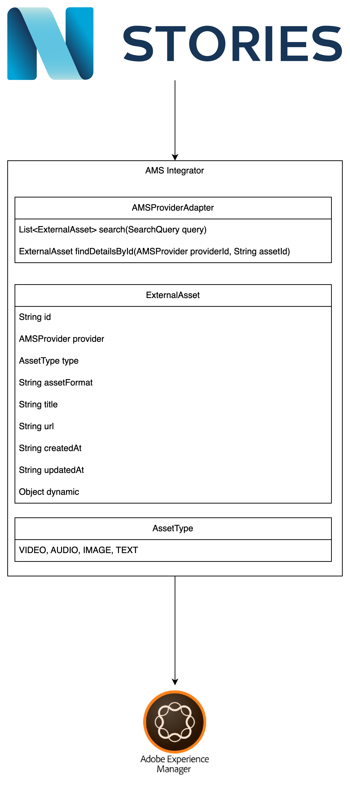

# README

This project implements a service allowing Newsmind Stories to interact with external asset management systems (AMS).



The picture above shows the high-level integration overview of the service. More details about this service and its purpose
can be found in the following [documentation](https://conv-it.atlassian.net/browse/NSTORIES-2870)


## Getting started

### Prerequisites

* [Java 21](https://sdkman.io/usage/)
* [Docker](https://docs.docker.com/get-docker/)

### Build the project

```bash
mvn clean install
```

### Run the project

```bash
mvn spring-boot:run -Dspring-boot.run.profiles=development
```
